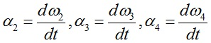
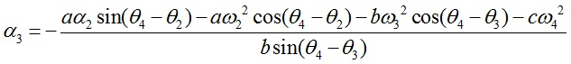
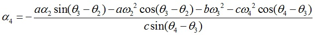

Let α2, α3 and α4 be the angular accelerations of the links 2,3 and 4 respectively. Given α2 is the input angular acceleration of the link 2. Since the link lengths a, b and c are known and for the given θ2 value, θ3 and θ4 can be determined using position analysis
and given ω2 the velocities ω3 and ω4 can be found using velocity analysis

The angular accelerations can then be found by

if the time data, t, is available. Otherwise, with the knowledge of α2 accelerations of links 3 and 4 can be found as given below

